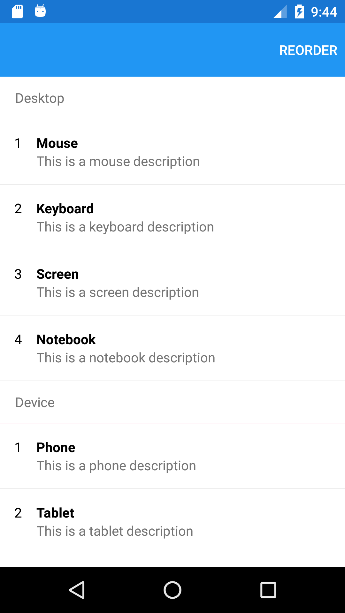
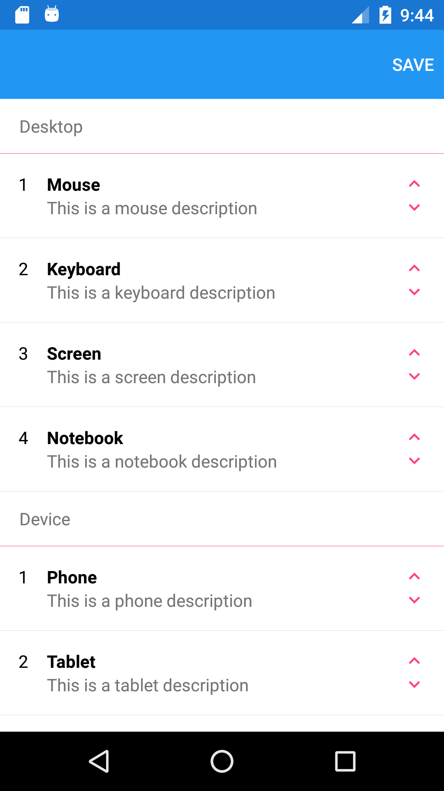

# Create a simple reorderable group enabled ListView

 

#### Supported Platforms
- Android
- iOS
- UWP

Platform focus:
- Android

#### Table of Contents
1. Add a grouping enabled `ListView`
2. Add a `ViewModel` and populate some grouped items
3. Add MoveUp and MoveDown `Commands`

Explore the code in the sample project for more details.

#### Remarks
- There is a `ContentPage` with `ToolbarItems` to Edit the `ListView` order
- The `ContentPage` is based on a `NavigationPage` so it can have `ToolbarItems`
- The `ContentPage` has a `ListView` with `IsGroupingEnabled` set to `True`
- For the **MoveUp** and **MoveDown** characters I used the Material Design icon font

## 1. Add a grouping enabled `ListView`
Open the **MainPage.xml** and add code to the `ListView` that executes the **MoveUp** and **MoveDown** `Commands`:

```xml
...

<!--Order TapGestures-->
<Label
    Grid.Column="2"
    Text="&#xe5ce;"
    IsVisible="{Binding BindingContext.EditMode, Source={x:Reference listView}}"
    Style="{StaticResource labelIconStyle}">
    <Label.GestureRecognizers>
    <TapGestureRecognizer 
        NumberOfTapsRequired="1"
        Command="{Binding BindingContext.MoveUpCommand, Source={x:Reference listView}}" 
        CommandParameter="{Binding .}"/>
    </Label.GestureRecognizers>
</Label>
<Label
    Grid.Column="2"
    Grid.Row="1"
    Text="&#xe5cf;"
    IsVisible="{Binding BindingContext.EditMode, Source={x:Reference listView}}"
    Style="{StaticResource labelIconStyle}">
    <Label.GestureRecognizers>
    <TapGestureRecognizer 
        NumberOfTapsRequired="1"
        Command="{Binding BindingContext.MoveDownCommand, Source={x:Reference listView}}" 
        CommandParameter="{Binding .}"/>
    </Label.GestureRecognizers>
</Label>

...
```

## 2. Add a `ViewModel` and populate some grouped items
Add a new class called **MainPageViewModel.cs** and add the following code to populate some grouped items:

```
...

LoadCommand = new Command(
    execute: () =>
    {
        var items = new List<Item>
        {
            new Item {
                Name = "Mouse",
                Description = "This is a mouse description",
                Category = "Desktop",
                Order = 1
            },
            new Item {
                Name = "Keyboard",
                Description = "This is a keyboard description",
                Category = "Desktop",
                Order = 2
            },
            new Item {
                Name = "Screen",
                Description = "This is a screen description",
                Category = "Desktop",
                Order = 3
            },
            new Item {
                Name = "Notebook",
                Description = "This is a notebook description",
                Category = "Desktop",
                Order = 4
            },
            new Item {
                Name = "Phone",
                Description = "This is a phone description",
                Category = "Device",
                Order = 1
            },
            new Item {
                Name = "Tablet",
                Description = "This is a tablet description",
                Category = "Device",
                Order = 2
            }
        };

        var grouped =
            from i in items
            orderby i.Order
            group i by i.Category into g
            select new Grouping<string, Item>(g.Key, g);

        ItemsGroupedByCategory = 
            new ObservableCollection<Grouping<string, Item>>(grouped);

        OnPropertyChanged(nameof(ItemsGroupedByCategory));
    },
    canExecute: () => { return true; });

...
```

## 2. Add MoveUp and MoveDown `Commands`
In the **MainPageViewModel.cs** class add the following code to reorder items:

```
...

MoveUpCommand = new Command<object>(
    execute: async (obj) =>
    {
        if (!(obj is Item item))
            return;

        await Task.Delay(10);

        var group = ItemsGroupedByCategory.Where(
            g => g.Key.Equals(item.Category)).FirstOrDefault();

        var oldIndex = group.IndexOf(item);
        var newIndex = oldIndex - 1;

        /// Prevent index out of group range exception.
        if (newIndex < 0)
            return;

        oldIndex += 1;

        group.Insert(newIndex, item);
        group.RemoveAt(oldIndex);

        /// Reset order for each item.
        int order = 1;
        for (int i = 0; i < group.Count; i++)
        {
            group[i].Order = order++;
        }
    },
    canExecute: (obj) => { return true; });

MoveDownCommand = new Command<object>(
    execute: async (obj) =>
    {
        if (!(obj is Item item))
            return;

        await Task.Delay(10);

        var group = ItemsGroupedByCategory.Where(
            g => g.Key.Equals(item.Category)).FirstOrDefault();

        var oldIndex = group.IndexOf(item);
        var newIndex = oldIndex + 2;

        /// Prevent index out of group range exception.
        if (newIndex > group.Count)
            return;

        group.Insert(newIndex, item);
        group.RemoveAt(oldIndex);

        /// Reset order for each item.
        int order = 1;
        for (int i = 0; i < group.Count; i++)
        {
            group[i].Order = order++;
        }
    },
    canExecute: (obj) => { return true; });

...
```
